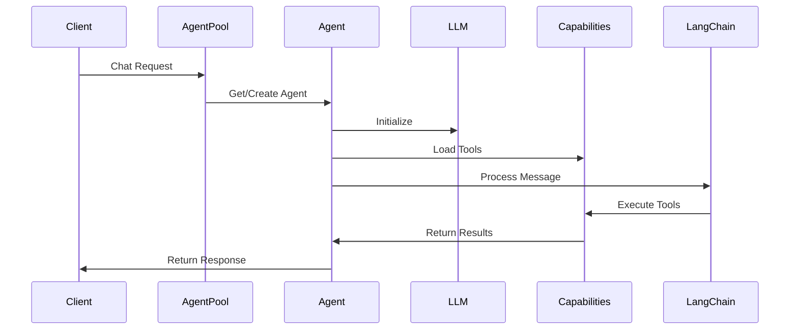
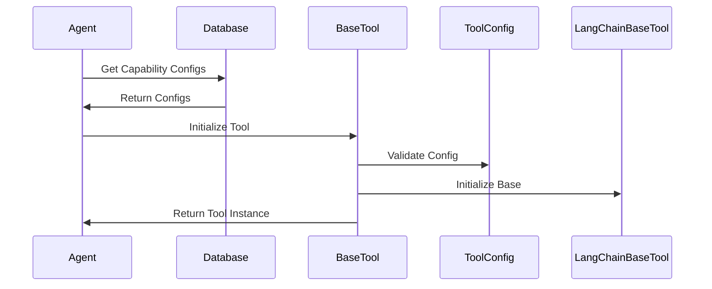

# AI Engine - Agent System Architecture

## Table of Contents
1. [Overview](#overview)
2. [Core Components](#core-components)
3. [Data Flow](#data-flow)
4. [Component Details](#component-details)
5. [Configuration Management](#configuration-management)
6. [Implementation Guidelines](#implementation-guidelines)
7. [Current Challenges](#current-challenges)
8. [Best Practices](#best-practices)

## Overview

The AI Engine is built around a dynamic agent system that allows for flexible integration of various AI capabilities. The system uses LangChain as its foundation and implements a pool-based approach for managing agent instances across user sessions.

## Core Components

### Component Hierarchy
```
AI Engine
├── AgentPool
│   └── Manages agent instances per session
├── Agent
│   ├── Integrates with LangChain
│   ├── Manages capabilities
│   └── Processes user messages
├── BaseTool
│   ├── Inherits from LangChain BaseTool
│   └── Base class for all capabilities
└── Capability Implementations
    ├── Weather
    ├── Calculator
    └── Google Search
```

### Key Classes and Their Responsibilities

#### 1. AgentPool
- Maintains a dictionary of agent instances
- Keys: Tuple of (agent_id, session_id)
- Values: Agent instances
- Handles agent lifecycle management
- Implements cleanup for inactive sessions

```python
class AgentPool:
    _instances: Dict[Tuple[str, str], Agent]
    
    async def get_agent(agent_id: str, session_id: str) -> Agent:
        # Get or create agent instance
    
    def cleanup_session(session_id: str) -> None:
        # Remove agents for inactive sessions
```

#### 2. Agent
- Core class that integrates with LangChain
- Manages tool loading and initialization
- Handles message processing and response generation

```python
class Agent:
    config: Dict[str, Any]
    tools: List[BaseTool]
    llm: BaseLLM
    agent_executor: AgentExecutor
    
    async def initialize() -> None:
        # Initialize LLM and tools
    
    async def process_message(message: str) -> str:
        # Process user input and return response
```

#### 3. BaseTool
- Abstract base class for all capabilities
- Handles configuration validation
- Provides common functionality for all tools

```python
class BaseTool(LangChainBaseTool):
    config: ToolConfig
    
    async def execute(input_data: Dict[str, Any]) -> Dict[str, Any]:
        # Abstract method for tool execution
    
    @property
    def args_schema() -> Dict[str, Any]:
        # Return tool parameters schema
```

## Data Flow

### Request Processing Flow


### Tool Initialization Flow


## Configuration Management

### Database Schema

#### 1. Agents Collection
```json
{
    "_id": ObjectId,
    "name": String,
    "description": String,
    "capabilities": [ObjectId],
    "llm": ObjectId,
    "inputFormat": String,
    "outputFormat": String
}
```

#### 2. Capabilities Collection
```json
{
    "_id": ObjectId,
    "name": String,
    "description": String,
    "file": String,
    "className": String,
    "category": String,
    "parameters": {
        "paramName": "paramType"
    }
}
```

#### 3. LLMs Collection
```json
{
    "_id": ObjectId,
    "name": String,
    "description": String,
    "type": String,
    "provider": String,
    "apiKey": String,
    "baseUrl": String,
    "modelName": String
}
```

## Implementation Guidelines

### 1. Tool Implementation
When implementing a new capability:

1. Create a new class inheriting from BaseTool
2. Implement required methods:
   - `__init__` for configuration
   - `execute` for main functionality
3. Add proper error handling
4. Include comprehensive logging
5. Add type hints for all methods

Example:
```python
class NewCapability(BaseTool):
    def __init__(self, config: Dict[str, Any]):
        # Set default config if needed
        if "name" not in config:
            config["name"] = "Capability Name"
        super().__init__(config)
    
    async def execute(self, input_data: Dict[str, Any]) -> Dict[str, Any]:
        try:
            # Implement capability logic
            return {"result": "success"}
        except Exception as e:
            logger.error(f"Error: {str(e)}")
            return {"error": str(e)}
```

### 2. Error Handling
- Use proper exception handling
- Implement proper logging
- Return meaningful error messages
- Handle edge cases

### 3. Testing Guidelines
- Unit test each capability
- Integration test agent system
- Test error scenarios
- Validate configuration handling

## Current Challenges

### 1. Pydantic Integration Issues
Current issues with Pydantic model initialization:
- `__pydantic_fields_set__` missing
- Inheritance chain initialization
- Configuration validation

### 2. Proposed Solutions

#### Solution 1: Separate Configuration
```python
class ToolConfig(BaseModel):
    name: str
    description: str
    parameters: Dict[str, str]

class BaseTool(LangChainBaseTool):
    def __init__(self, config: Dict[str, Any]):
        validated_config = ToolConfig(**config)
        super().__init__(
            name=validated_config.name,
            description=validated_config.description
        )
```

#### Solution 2: Direct Inheritance
```python
class BaseTool(LangChainBaseTool):
    name: str
    description: str
    parameters: Dict[str, str]

    class Config:
        arbitrary_types_allowed = True
```

## Best Practices

### 1. Code Organization
- Keep capabilities in separate modules
- Use clear naming conventions
- Maintain proper directory structure

### 2. Configuration Management
- Use environment variables for sensitive data
- Implement configuration validation
- Use type hints consistently

### 3. Error Handling
- Implement proper logging
- Use custom exceptions
- Return meaningful error messages

### 4. Testing
- Write comprehensive tests
- Test edge cases
- Validate configuration handling

### 5. Documentation
- Document all public methods
- Include usage examples
- Maintain architecture documentation

## Next Steps

1. Fix Pydantic integration issues
2. Implement proper configuration validation
3. Add comprehensive testing
4. Improve error handling
5. Enhance documentation 